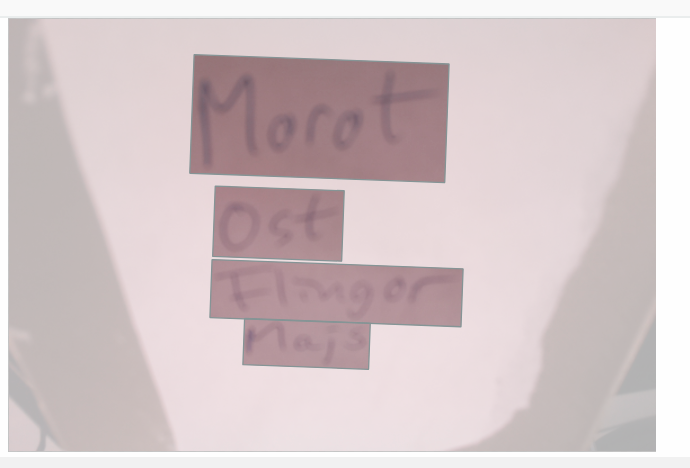
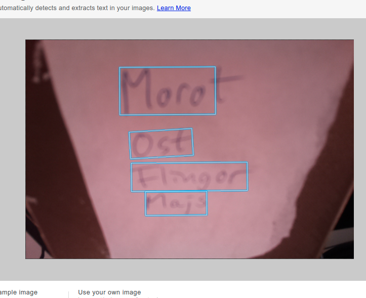
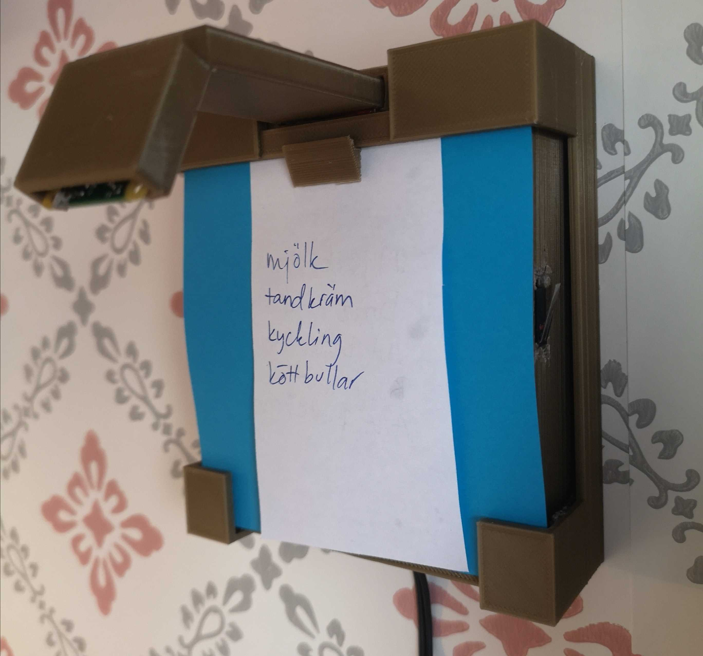

# Building a hand written shopping list interpretor for MatHem.se

Using your fingers to type on a keyboard or phone when searching for things to buy is the assumed most efficient way to shop online. Along came voice assistants a few years ago as a good alternative to the screen.

I think there's a good point in minimising pulling the phone up form the pocket and in my family we have a habit of using old fashioned hand written shopping lists that, when it's time to place the order, we type into the search bar at [Mathem](mathem.se). This means we're writing it twice - once with a pen and once with a keyboard which is way too inefficient.

To tackle this problem I decided to bridge the gap between the physical list and the online cart by building a scanning device that uses hand writing recognition along with existing Mathem APIs. I wanted to have this done as a weekend project, and knowing that the 3D modelling and printing would be the most time consuming parts, I decided to time cap the development time to 4 hours.

## Hardware
I decided to use components I had lying around at home;
* [Raspberry Pi 3 Model B+](https://www.amazon.com/ELEMENT-Element14-Raspberry-Pi-Motherboard/dp/B07P4LSDYV) running latest Raspberry Pi OS
* [Bump sensor](https://joy-it.net/en/products/SEN-BUMP01). Used as button. There are probably better buttons out there, but this was accessible
* [Raspberry Pi Camera Module](https://www.amazon.com/Raspberry-Pi-Camera-Module-Megapixel/dp/B01ER2SKFS/)

The case was printed using a [Creality Ender Pro 3](https://www.amazon.com/Creality-Ender-Printer-Year-Warranty/dp/B08GJ8FV37)

Wiring the bump sensor is easily done. It has three pins - one for ground, one for power and one for GPIO - take note of the pin you use. In the code below I use GPIO 12, but it could be any GPIO.

## Device software
#### Fundamental decisions
Firstly I had to decide where to do the inference - on the edge or in the cloud. There are solutions for this that can run on the Pi, but that would tie this feature to the hardware. What if I want to move it to a less performant hardware or integrate it in our mobile apps?

The only benefit I could see for running it on the Raspberry Pi would be that it'd probably be faster since it would be fewer roundtrips to the cloud.

With extensibility in mind I decided to make the edge device dumb and literally just capture the image and upload to the cloud.

#### Authentication
At Mathem we use Cognito User Pools for authentication. Since the UI for this this device is just a bump sensor we need to perform a headless login. I perform this the same way as you do [headless authentication](https://www.raspberrypi.org/documentation/configuration/wireless/headless.md) to your WiFi network, but with a custom file in the boot partition, `mh-credentials.json`:
```
{
    "username": "me@email.com",
    "password": "mypassword"
}
```
_make sure to change the default password and that it's not publicly accessible over the internet_

In `/home/pi/camera` we place a python script, camera.py:

```
import RPi.GPIO as GPIO
import time
import json
from picamera import PiCamera
from pycognito import Cognito
import requests

userPoolId = 'eu-west-1_abcdefgh'
appClientId = '1unghcf5krf83i76325abcdefg'

credentials = None
with open('/boot/mh-credentials.json') as credentials_file:
    credentials = json.load(credentials_file)

user = Cognito(userPoolId, appClientId, username=credentials['username'])

user.authenticate(password=credentials['password'])
```
This reads the credentials file and uses [pycognito](https://pypi.org/project/pycognito/) to authenticate the username and password.

Next, we initialise the camera and the bump sensor
```
camera = PiCamera()
camera.rotation = 180  # The camera is fitted on the device upside down, so we need to rotate it
GPIO.setmode(GPIO.BCM) # This means I'm using GPIO numbering instead of board numbering

GPIO.setup(12, GPIO.IN, pull_up_down=GPIO.PUD_UP) # Use GPIO 12
GPIO.add_event_detect(12, GPIO.RISING, callback=capture, bouncetime=3000) # add event listener to bump sensor
while True:
    time.sleep(10)  # Wait for input
```

The above snippet assigns `capture()` as a callback to the GPIO event:
```
def capture(channel):    
    global user

    # Refresh token if expired
    user = Cognito(userPoolId, appClientId, id_token=user.id_token,refresh_token=user.refresh_token, access_token=user.access_token)
    
    # Set authorization header
    headers = {'authorization': user.id_token, 'content-type': 'image/jpg'}
    
    # Request presigned URL
    s3url = requests.get('https://api.mathem.io/cam-cart/s3/signedurl', headers=headers)
    contentDict = json.loads(s3url.content)
    signedUrl = contentDict["url"]

    # Take picture
    camera.capture('/tmp/capture.jpg')
    print('Captured image. Uploading...')

    # Upload
    with open('/tmp/capture.jpg', 'rb') as f:
        http_response = requests.put(signedUrl, data=f.read())
        print('Done!')
```
Note that the S3 key will have the format `<userid>/<timestamp>.jpg`. More on that later.

To make this run on startup, add the following to `/etc/rc.local`:
```
sudo python3 /home/pi/camera/camera.py
```

## Backend architecture
Already having a 100% serverless artchitecture made it simple to hook this workflow into the mix.

The prerequisite for uploading an image in a secure manner is to obtain a presigned URL that allows this. Having already authenticated the device, we can now call an API Gateway endpoint that authorizes the user before invoking the following code. For nodejs we use Jeremy Daly's [lambda-api](https://github.com/jeremydaly/lambda-api).

```
async function get(req, res) {
  const jwt = req.headers.authorization;
  const claims = jwtDecode(jwt);
  // adding custom claim `userid` to the file name
  const filename = `${claims['custom:userid']}/${new Date().getTime()}.jpg`;
  const url = await s3.getSignedUrlPromise('putObject', {
    Bucket: process.env.Bucket,
    Key: filename,
    Expires: 10 // valid for 10 seconds
  });
  return res.status(200).send({ url });
}
```

Next we need to act when new images get uploaded. We do this by triggering a lambda function `upload-trigger.js` when new objects get created. 

```  
UploadTrigger:
    Type: 'AWS::Serverless::Function'
    Properties:
        Handler: src/upload-trigger.handler
        Policies:
        - AmazonAPIGatewayInvokeFullAccess
        - Version: 2012-10-17
            Statement:
            - Sid: Statement1
                Effect: Allow
                Action:
                - 'textract:detectDocumentText'
                Resource: '*'
        - S3CrudPolicy:
            BucketName: !Sub ${AWS::AccountId}-${AWS::Region}-cam-cart
        Events:
        S3Event:
            Type: S3
            Properties:
            Bucket: !Ref Bucket
            Events: s3:ObjectCreated:*
```

#### Choosing AI service

AWS offers two AI services that can recognize hand writing; [Rekognition](https://aws.amazon.com/rekognition/) and [Textract](https://aws.amazon.com/textract/). At first I wasn't aware that Textract had this capabliity, but it turns out it was [announced](https://aws.amazon.com/blogs/machine-learning/amazon-textract-recognizes-handwriting-and-adds-five-new-languages/) only about a month ago since the time of writing.

Using the Rekognition API worked ok, but it wasn't great once the hand writing turned scribbly. Also, as you'll see later on, the camera is fitted a bit too close to the paper, so no matter how I turn the lens, it will always be out of focus.

Once I realised Textract had similar capabilities I did some side-by-side comparison and realised that using Textract takes this project a step further from a fun proof-of-concept into an actually useful device.

Here follows an example of using the same blurry image in Rekogintion vs. Textract. Since MatHem is currently only offered in Swedish, so are the items on the list:

<table>
  <tr>
    <td>Textract</td>
    <td>Rekognition</td>
   </tr> 
   <tr>
      <td></td> 
      <td></td>
  </tr>
   <tr>
      <td>Pricing</td>
      <td>Pricing</td>
  </tr>
   <tr>
      <td><a href="https://aws.amazon.com/textract/pricing/" target="_blank">$0.0015 per document (image) after free tier</a></td>
      <td><a href="https://aws.amazon.com/rekognition/pricing/" target="_blank">$0.001 per image after free tier</a></td>
  </tr>
</table>
Here we can see that textract nailed all four words while Rekognition really struggled. Now, our product search engine allows for typos, so the end result still often made sense with Rekogintion's results, but Textract was still superior.

Also - Rekognition just gives a list of words and their coordinates in the image while Textract categorises the matches into blocks, so for example "bar of soap" would be one search term using Textract, but three separate ones using Textract.

Pricing is similar and although Textract is charged a bit higher, for our volumes it's neglectable, but 

With all that in account and the fact that Textract is the better service name, the choice was simple.

#### upload-trigger.js
```
exports.handler = async function (event) {
  const s3Record = event.Records[0].s3;

  const detection = await textract
    .detectDocumentText({
      Document: {
        S3Object: { Bucket: s3Record.bucket.name, Name: s3Record.object.key }
      }
    })
    .promise();

  // Get user id based on the S3 object prefix
  const userId = s3Record.object.key.split('/')[0]; 

  for (const block of detection.Blocks.filter((p) => p.BlockType === 'LINE')) {
    if (block.Confidence > 80) {
        // call internal APIs to search product and add to cart
    }
  }
};
```

When calling the Textract API you can choose if you wnat top do it synchronously or in a asyncrhonous fire-and-forget manner. The latter means that you pass it an SNS topic ARN to which it sends a notification when the job is done.

Here I went for the syncronous call since these images are small and processed fairly quickly (~2s) and I feel it favours the end-to-end duration.

That's it for the code. The detected text is passed to internal APIs and the front end is updated using websockets, but that's out of scope for this article.

## Designing the case
The inital proof of concept wasn't presented in a very usability inviting way, so I had to wrap all the wiring up in a sturdy case:


The end result is this wall mounted beauty:


I'm a noob when it comes to 3D modelling, but it's really easy to get started with Tinkercad.com. 

The case consists of three items;
* A case with screw holes for attaching the Raspberry Pi and bump sensor
* An arm holding the camera. The arm is hollow to allow us to hide the flexicable. This arm would benefit from being longer to get less blurry images, but I was constrained to the 10cm length of the stock flexicable
* A wall mount that the inner construction slides into

#### Inner case and arm
[!Case and arm](./case-and-arm.png)

Printed and all wired up it looks like this:
[!Case inside](./case-inside.png)

These took ~12 hours to print

#### Outer casing / wall mount
[!Wall mount model](./wallmount.png)

The inner casing slides perfectly into the mount and the back of the mount secures the loose cables in place.

#### End result
Here I have mounted it on the wall in the kitchen next to my Echo Show on which I've browsed and logged in to to mathem.se using Firefox the sake of this demo. I also coated the device with a blue paper to add some friction to when I push the shopping list in.

